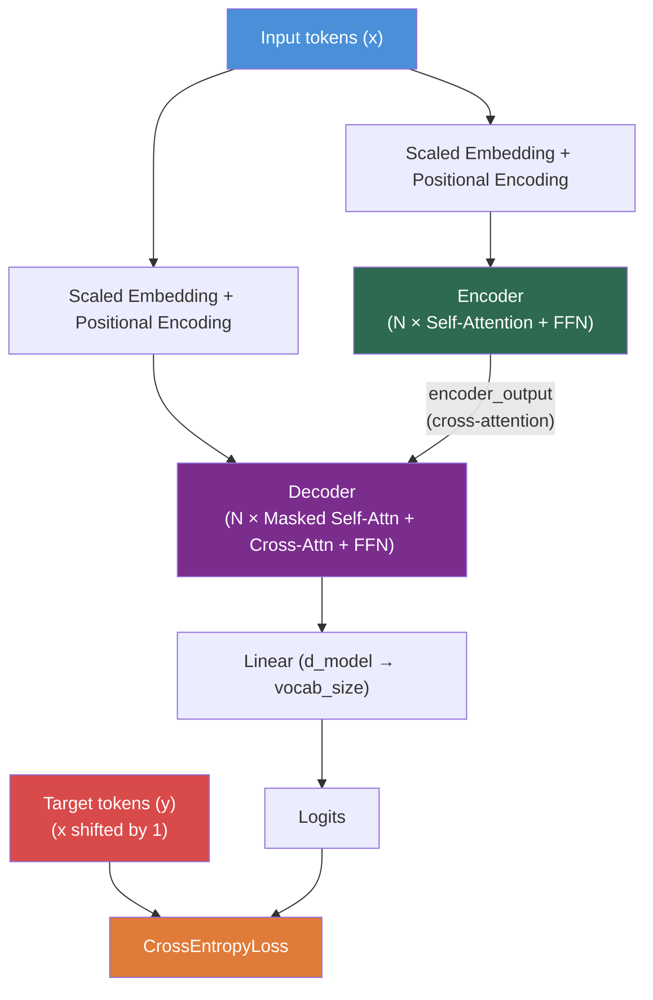
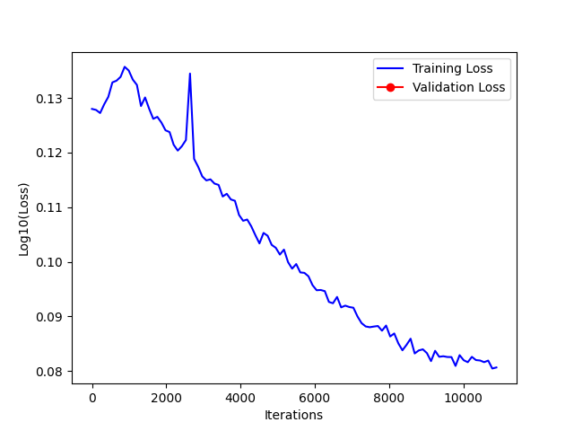

# GPT — Character-Level Transformer Language Model

A from-scratch implementation of the Transformer architecture described in [Attention Is All You Need](Attention%20is%20all%20you%20need.pdf) (Vaswani et al., 2017), adapted for character-level language modelling on Shakespeare text.

---

## Table of Contents

- [Architecture Overview](#architecture-overview)
  - [High-Level Data Flow](#high-level-data-flow)
  - [Tokenizer](#tokenizer)
  - [Scaled Embedding](#scaled-embedding)
  - [Positional Encoding](#positional-encoding)
  - [Encoder](#encoder)
  - [Decoder](#decoder)
  - [Final Linear Projection](#final-linear-projection)
- [Causal Masking](#causal-masking)
  - [Why Every Attention Head Needs a Mask](#why-every-attention-head-needs-a-mask)
  - [Mask Generation](#mask-generation)
  - [Where Each Mask Is Applied](#where-each-mask-is-applied)
- [Training](#training)
  - [Batching](#batching)
  - [Optimizer and Scheduler](#optimizer-and-scheduler)
  - [Gradient Clipping](#gradient-clipping)
  - [Loss Spike Explanation](#loss-spike-explanation)
- [Experiment Log](#experiment-log)
- [Loss Curve](#loss-curve)
- [Sampling / Inference](#sampling--inference)
- [Pretrained Weights](#pretrained-weights)
- [Generated Output](#generated-output)
- [Project Structure](#project-structure)

---

## Architecture Overview

The model is a full encoder-decoder Transformer repurposed as a causal language model. Both the encoder and decoder receive the **same** context window; the target sequence (context shifted by one position) is used **only** for computing the cross-entropy loss — never fed into the network — so the model must genuinely predict the next token.

### High-Level Data Flow



Orchestrated in `main/transformer/transformer.py : Transformer.forward` (line 22):

```python
def forward(self, x, y, src_pad_mask=None, tgt_mask=None, tgt_pad_mask=None):
    src_mask = self._causal_mask(src_len, src_len, mask_device)
    if tgt_mask is None:
        tgt_mask = self._causal_mask(tgt_len, tgt_len, mask_device)
    memory_mask = self._causal_mask(tgt_len, src_len, mask_device)

    encoder_output = self.encoder(x, attn_mask=src_mask, key_padding_mask=src_pad_mask)
    decoder_output = self.decoder(y, encoder_output, tgt_mask=tgt_mask, ...)
    logits = self.linear(decoder_output)
    return logits
```

### Tokenizer

A character-level tokenizer that maps each unique character in the training corpus to an integer index.

- **File:** `main/tokenizer.py : Tokenizer`
- `encode(text)` (line 12) — string to list of integers
- `decode(indices)` (line 16) — list of integers back to string
- Vocabulary size is determined by the number of unique characters in the input text (65 for the Shakespeare corpus)

### Scaled Embedding

Token indices are mapped to dense vectors of dimension `d_model` and scaled by `√d_model`, as prescribed in Section 3.4 of the [paper](Attention%20is%20all%20you%20need.pdf).

- **File:** `main/transformer/embedder/scaled_embedding.py : ScaledEmbedding.forward` (line 12)

```python
def forward(self, x):
    x = self.embedding(x) * self.scale   # scale = √d_model
    return x
```

### Positional Encoding

Since the Transformer has no recurrence or convolution, positional information is injected using fixed sinusoidal encodings (Section 3.5 of the paper). Even and odd dimensions use `sin` and `cos` respectively with exponentially increasing wavelengths.

- **File:** `main/transformer/embedder/positional_encoding.py : PositionalEncoding.__init__` (line 6)

```python
position = torch.arange(0, max_len).unsqueeze(1)
div_term = torch.exp(torch.arange(0, d_model, 2) * -(math.log(10000.0) / d_model))
self.positional_encoding[:, 0::2] = torch.sin(position * div_term)
self.positional_encoding[:, 1::2] = torch.cos(position * div_term)
```

These encodings are **not** learned — `requires_grad=False`.

### Encoder

The encoder transforms the input token sequence into a sequence of contextualised representations. It consists of:

1. **Scaled Embedding + Positional Encoding + Dropout**
2. **N stacked `TransformerEncoderLayer` blocks**, each containing:
   - **Causal Multi-Head Self-Attention** with residual connection and LayerNorm
   - **Position-wise Feed-Forward Network** (Linear → ReLU → Linear) with residual connection and LayerNorm

- **File:** `main/transformer/encoder/encoder.py : Encoder.forward` (line 23)
- **Layer:** `main/transformer/encoder/transformer_encoder_layer.py : TransformerEncoderLayer.forward` (line 18)

```python
# TransformerEncoderLayer.forward
attn_output, _ = self.mha(x, x, x, attn_mask=attn_mask, key_padding_mask=key_padding_mask)
x = self.layernorm1(x + self.dropout1(attn_output))

ffn_output = self.ffn(x)
x = self.layernorm2(x + self.dropout2(ffn_output))
```

### Decoder

Each decoder layer has **three** sub-layers, following Figure 1 of the paper:

1. **Masked Self-Attention** — the decoder attends to its own previous positions only (causal mask prevents looking ahead)
2. **Cross-Attention** — queries come from the decoder, keys and values from the encoder output. A causal `memory_mask` prevents the decoder from reading future context from the encoder
3. **Position-wise Feed-Forward Network** — same structure as in the encoder

Each sub-layer uses dropout, a residual connection, and LayerNorm.

- **File:** `main/transformer/decoder/decoder.py : Decoder.forward` (line 20)
- **Layer:** `main/transformer/decoder/transformer_decoder_layer.py : TransformerDecoderLayer.forward` (line 20)

```python
# TransformerDecoderLayer.forward
# 1. Masked Self-Attention
attn_output, _ = self.masked_mha(x, x, x, attn_mask=tgt_mask, ...)
x = self.layernorm1(x + self.dropout1(attn_output))

# 2. Cross-Attention (with causal memory_mask)
attn_output, _ = self.crossed_mha(x, encoder_output, encoder_output, attn_mask=memory_mask, ...)
x = self.layernorm2(x + self.dropout2(attn_output))

# 3. Feed-Forward
ffn_output = self.ffn(x)
x = self.layernorm3(x + self.dropout3(ffn_output))
```

### Final Linear Projection

After the decoder stack, a linear layer projects the `d_model`-dimensional representations to logits over the vocabulary.

- **File:** `main/transformer/transformer.py : Transformer.__init__` (line 19)

```python
self.linear = nn.Linear(d_model, tgt_vocab_size, device=device)
```

No softmax is applied because `nn.CrossEntropyLoss` operates on raw logits.

---

## Causal Masking

### Why Every Attention Head Needs a Mask

In a standard seq2seq setup (e.g. translation), the encoder is allowed to see the full source sentence. But in this implementation, the same context window `x` is fed to **both** the encoder and decoder. Without causal masking, the encoder's bidirectional self-attention would encode future tokens into its output, and the decoder's cross-attention would then read those future tokens — effectively leaking the answer the model is supposed to predict.

To prevent this, **three separate causal masks** are generated:

| Mask | Applied to | Purpose |
|------|-----------|---------|
| `src_mask` | Encoder self-attention | Prevents encoder position `j` from attending to positions `> j` |
| `tgt_mask` | Decoder self-attention | Standard look-ahead mask (Section 3.1 of the paper) |
| `memory_mask` | Decoder cross-attention | Prevents decoder position `t` from reading encoder position `> t` |

### Mask Generation

All three masks are generated by the same helper method.

- **File:** `main/transformer/transformer.py : Transformer._causal_mask` (line 48)

```python
@staticmethod
def _causal_mask(size_q, size_k, device):
    return torch.triu(torch.ones(size_q, size_k, dtype=torch.bool, device=device), diagonal=1)
```

This produces an upper-triangular boolean matrix where `True` means "block this position". For a sequence of length 4:

```
[[False,  True,  True,  True],
 [False, False,  True,  True],
 [False, False, False,  True],
 [False, False, False, False]]
```

Position 0 can only attend to itself, position 1 to positions 0–1, and so on.

### Where Each Mask Is Applied

Built and applied inside `Transformer.forward` (line 22):

```python
src_mask    = self._causal_mask(src_len, src_len, ...)   # → Encoder self-attention
tgt_mask    = self._causal_mask(tgt_len, tgt_len, ...)   # → Decoder self-attention
memory_mask = self._causal_mask(tgt_len, src_len, ...)   # → Decoder cross-attention
```

---

## Training

### Batching

Each iteration samples a **fresh random mini-batch** from the full training set (90/10 train/val split). The window length equals `max_len` (the context length), and the target `y` is the same window shifted by one character.

- **File:** `main/gpt.py : GPT.get_batch` (line 198)

```python
def get_batch(self, data):
    ix = torch.randint(len(data) - self.max_len, (self.training_batch_size,), device=device)
    x = torch.stack([data[i:i+self.max_len] for i in ix])
    y = torch.stack([data[i+1:i+self.max_len+1] for i in ix])
    return x, y
```

### Optimizer and Scheduler

- **Optimizer:** AdamW with weight decay of 0.1
- **Scheduler:** OneCycleLR — warms the learning rate up from `max_lr / div_factor` to `max_lr` over the first 10% of training (`pct_start=0.1`), then cosine-anneals it down to near zero

- **File:** `main/gpt.py : GPT.train_model` (lines 110–124)

```python
optimizer = torch.optim.AdamW(self.model.parameters(), lr=self.learning_rate, weight_decay=self.weight_decay)

scheduler = torch.optim.lr_scheduler.OneCycleLR(
    optimizer=optimizer,
    max_lr=self.learning_rate,
    total_steps=self.learning_iteration,
    div_factor=25.0,
    final_div_factor=1e4,
    pct_start=0.1
)
```

The scheduler steps once per batch, immediately after `optimizer.step()` (line 155).

### Gradient Clipping

Gradient norms are clipped to 1.0 before each optimizer step to prevent exploding gradients, which Transformers are particularly prone to.

- **File:** `main/gpt.py : GPT.train_model` (line 150)

```python
torch.nn.utils.clip_grad_norm_(self.model.parameters(), 1.0)
```

### Loss Spike Explanation

The loss curve shows a visible spike around iteration ~1000 (10% of the 10,000 total steps). This is **not** a bug — it is the expected behaviour of the OneCycleLR scheduler.

With `pct_start=0.1`, the learning rate ramps from `max_lr / 25` up to `max_lr` over the first 1,000 iterations. At the peak, the learning rate is at its maximum value, causing temporarily larger gradient steps that overshoot the current loss basin. The model is briefly pushed out of its local optimum, and the loss jumps.

As the cosine annealing phase begins and the learning rate steadily decreases over the remaining 9,000 iterations, the optimiser settles into a better basin with finer steps. The loss recovers and ultimately converges to a **lower** value than it held before the spike — demonstrating that the schedule successfully explored beyond the initial local minimum.

---

## Experiment Log

All experiment runs are logged to [`experiment_logs.csv`](experiment_logs.csv).

| Timestamp | Params | Vocab | d_model | max_len | Layers | Heads | d_ff | Dropout | Batch | Train Batch | Iterations | Optimizer | LR | Weight Decay | Train Loss | Val Loss |
|-----------|--------|-------|---------|---------|--------|-------|------|---------|-------|-------------|------------|-----------|------|--------------|------------|----------|
| 2026-07-17 13:22 | 184,481 | 65 | 32 | 32 | 6 | 4 | 2048 | 0.1 | 8 | 64 | 1,000 | AdamW | 1e-3 | 0.1 | 0.0069 | 0.0792 |
| 2026-07-17 13:36 | 184,481 | 65 | 32 | 32 | 6 | 4 | 2048 | 0.1 | 8 | 64 | 1,000 | AdamW | 1e-3 | 0.1 | 0.0157 | 5.7022 |
| 2026-07-17 13:44 | 184,481 | 65 | 32 | 32 | 6 | 4 | 2048 | 0.1 | 8 | 64 | 1,000 | AdamW | 1e-3 | 0.1 | 2.1691 | 2.1255 |
| 2026-07-17 14:10 | 184,481 | 65 | 32 | 32 | 6 | 4 | 2048 | 0.1 | 8 | 64 | 10,000 | AdamW | 1e-3 | 0.1 | 1.7240 | 1.8210 |
| 2026-07-17 14:24 | 712,961 | 65 | 64 | 64 | 6 | 4 | 2048 | 0.1 | 8 | 64 | 10,000 | AdamW | 1e-3 | 0.1 | 1.4093 | 1.5646 |
| 2026-07-17 15:17 | 2,802,113 | 65 | 128 | 128 | 6 | 8 | 2048 | 0.1 | 8 | 64 | 10,000 | AdamW | 1e-3 | 0.1 | 1.2769 | 1.5246 |
| 2026-07-17 16:29 | 2,802,113 | 65 | 128 | 128 | 6 | 8 | 2048 | 0.1 | 16 | 64 | 10,000 | AdamW | 3e-4 | 0.1 | 1.2712 | 1.5476 |

Key observations across experiments:
- Scaling `d_model` from 32 → 64 → 128 (and increasing `n_heads` accordingly) steadily decreased training loss
- The first two rows represent runs before causal masking was fixed — the near-zero train loss and high validation loss were caused by target leakage, not genuine learning
- Reducing the learning rate from 1e-3 to 3e-4 eliminated the OneCycleLR loss spike

---

## Loss Curve

The training loss curve for the best run (`d_model=128`, `n_heads=8`, `max_lr=3e-4`, 10,000 iterations):



The y-axis is `log10(loss)`. The small bump around iteration ~1000 corresponds to the OneCycleLR warm-up peak as described in [Loss Spike Explanation](#loss-spike-explanation). After the warm-up phase ends, the cosine annealing schedule steadily reduces the learning rate and the loss converges smoothly.

---

## Sampling / Inference

The `sample` method autoregressively generates text from a prompt. At each step, it feeds the last `max_len` tokens as context to both the encoder and decoder, reads the logits from the last position, applies temperature scaling and optional top-k filtering, then samples the next token.

- **File:** `main/gpt.py : GPT.sample` (line 206)

```python
@torch.no_grad()
def sample(self, prompt, max_new_tokens=200, temperature=1.0, top_k=None, ...):
    for _ in range(max_new_tokens):
        context = generated[-self.max_len:]
        context_t = torch.tensor(context, dtype=torch.long, device=device).unsqueeze(0)
        logits = self.model(context_t, context_t)
        logits = logits[:, -1, :] / temperature
        ...
```

---

## Pretrained Weights

The trained model weights are saved at [`weights/transformer.pt`](weights/transformer.pt). The `WeightManager` class handles saving and loading checkpoints, which include the full `model.state_dict()`.

- **File:** `main/weight_manager.py : WeightManager`

When `main.py` is run:
- If `transformer.pt` exists → weights are loaded and only validation is run (no training)
- If no weights exist → full training is run, weights are saved, and experiment metrics are logged

---

## Generated Output

A sample of model-generated text is available at [`resources/output_2026-07-17_17-29-58.txt`](resources/output_2026-07-17_17-29-58.txt). This was generated with `temperature=0.8` and `max_new_tokens=10000` from the pretrained weights.

---

## Project Structure

```
GPT/
├── README.md
├── Attention is all you need.pdf      # Reference paper
├── experiment_logs.csv                 # Hyperparameter and loss logs
├── loss_graph.png                      # Training loss curve
├── main/
│   ├── main.py                         # Entry point
│   ├── gpt.py                          # GPT class (training, validation, sampling)
│   ├── tokenizer.py                    # Character-level tokenizer
│   ├── create_dataset.py               # Text → tensor conversion
│   ├── plotting.py                     # Loss tracking and visualisation
│   ├── weight_manager.py               # Checkpoint save/load
│   └── transformer/
│       ├── transformer.py              # Top-level Transformer (encoder + decoder + masking)
│       ├── encoder/
│       │   ├── encoder.py              # Encoder stack
│       │   └── transformer_encoder_layer.py  # Single encoder layer
│       ├── decoder/
│       │   ├── decoder.py              # Decoder stack
│       │   └── transformer_decoder_layer.py  # Single decoder layer
│       └── embedder/
│           ├── scaled_embedding.py     # √d_model-scaled token embedding
│           └── positional_encoding.py  # Sinusoidal positional encoding
├── resources/
│   ├── input.txt                       # Shakespeare training corpus
│   └── output_2026-07-17_17-29-58.txt  # Generated sample output
└── weights/
    └── transformer.pt                  # Pretrained model checkpoint
```
