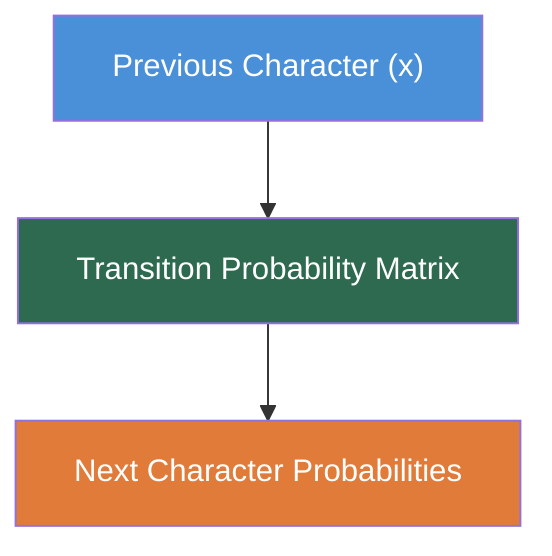
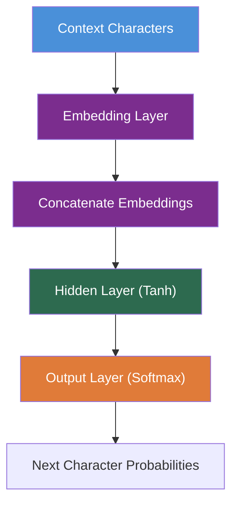
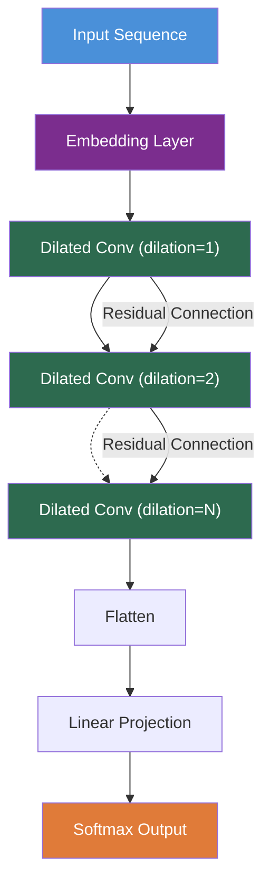
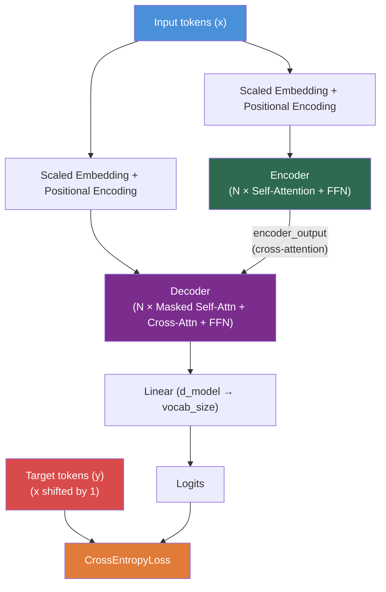

# Language Models

This repository contains from-scratch implementations of four language models in Python using PyTorch, progressing from simple statistical baselines to a full Transformer architecture.

| Model | Description |
|---|---|
| **[Bigram Language Model](bi-gram%20language%20model/README.md)** | A simple n-gram model that predicts the next character based on the previous character. |
| **[Neural Probabilistic Language Model](neural%20probabilistic%20language%20model/README.md)** | A neural network-based approach with embedding, hidden, and softmax layers. |
| **[WaveNet Language Model](wave-net%20language%20model/README.md)** | A convolutional neural network with dilated convolutions for efficient sequence modelling. |
| **[GPT (Transformer) Language Model](GPT/README.md)** | A full encoder-decoder Transformer adapted for causal language modelling, based on *Attention Is All You Need*. |

---

## Project Structure

```
.
├── bi-gram language model/
│   ├── main/                    # Main implementation files
│   ├── resources/               # Training data
│   └── README.md
├── neural probabilistic language model/
│   ├── main/                    # Main implementation files
│   ├── resources/               # Training data
│   └── README.md
├── wave-net language model/
│   ├── main/                    # Main implementation files
│   ├── resources/               # Training data
│   ├── Figure_1.png             # Training loss graph
│   └── README.md
└── GPT/
    ├── main/                    # GPT class, tokenizer, transformer modules
    ├── resources/               # Shakespeare training corpus and generated output
    ├── weights/                 # Pretrained model checkpoint
    ├── experiment_logs.csv      # Hyperparameter and loss logs
    ├── loss_graph.png           # Training loss curve
    ├── Attention is all you need.pdf  # Reference paper
    └── README.md
```

---

## Bigram Language Model

**[📖 Read the full Bigram README](bi-gram%20language%20model/README.md)**

The bigram language model is a simple character-level model that predicts the next character based on the previous character. It uses a lookup table approach to store transition probabilities between characters.

### Architecture



### Features:
- Character-level language modelling
- Training from text data
- Weight saving and loading capabilities
- Generation of new text samples

### How to Run:
```bash
cd bi-gram\ language\ model/main
python main.py
```

---

## Neural Probabilistic Language Model

**[📖 Read the full Neural Probabilistic Model README](neural%20probabilistic%20language%20model/README.md)**

The neural probabilistic language model uses a neural network to predict the next character in a sequence. It consists of embedding, hidden, and softmax layers.

### Architecture



### Features:
- Neural network-based language modelling
- Embedding layer for character representations
- Hidden layer with tanh activation
- Softmax output layer for probability distribution
- Dynamically adjusting learning rate depending upon if the loss increases or decreases
- L2 Regularisation (Weight Decay) during loss calculation
- Kaiming initialisation of the hidden tanh layer
- Batch normalisation

### How to Run:
```bash
cd neural\ probabilistic\ language\ model/main
python main.py
```

---

## WaveNet Language Model

**[📖 Read the full WaveNet README](wave-net%20language%20model/README.md)**

The WaveNet language model implements a convolutional neural network architecture for sequence modelling. It uses dilated convolutions and residual connections to efficiently capture long-range dependencies in text data.

### Architecture



### Features:
- Character-level language modelling
- Dilated convolutional layers for efficient sequence processing
- Batch normalisation and dropout for stable training
- Residual connections for better gradient flow
- Training from text data with dynamic learning rate scheduling
- Loss visualisation capabilities
- Weight manager class that saves and loads the model weights

### How to Run:
```bash
cd wave-net\ language\ model/main
python main.py
```

---

## GPT (Transformer) Language Model

**[📖 Read the full GPT README](GPT/README.md)**

A from-scratch implementation of the full Transformer architecture from [Attention Is All You Need](GPT/Attention%20is%20all%20you%20need.pdf), adapted for character-level causal language modelling on Shakespeare text. The model uses an encoder-decoder structure with causal masking on all three attention mechanisms (encoder self-attention, decoder self-attention, and cross-attention) to prevent future-token leakage.

### Architecture



### Features:
- Full encoder-decoder Transformer with multi-head attention
- Scaled embeddings and sinusoidal positional encoding
- Causal masking across encoder, decoder, and cross-attention
- Character-level tokenizer (65-token vocabulary)
- AdamW optimiser with OneCycleLR learning rate scheduler
- Gradient clipping for training stability
- Weight manager for saving/loading checkpoints
- Temperature-controlled and top-k sampling for text generation
- Experiment logging to CSV

### How to Run:
```bash
cd GPT/main
python main.py
```

---

## Requirements

All models require Python 3 and PyTorch:

```bash
pip install torch
```

The GPT model additionally uses `matplotlib` for loss visualisation:

```bash
pip install matplotlib
```

## Data

- The bigram, neural probabilistic, and WaveNet models use `names.txt` (a list of names) in their respective `resources/` directories.
- The GPT model uses `input.txt` (Shakespeare text corpus) in `GPT/resources/`.

## License

This project is licensed under the MIT License.
