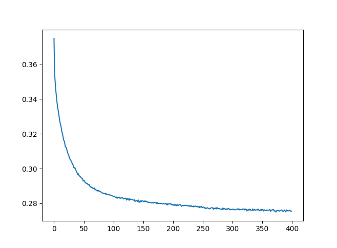

# Neural Probabilistic Language Model

This is an implementation of a neural probabilistic language model (Yoshua Bengio 2003 paper) using PyTorch. The model predicts the next character in a sequence based on the previous characters, using a neural network approach.

## Model Architecture

The neural probabilistic language model consists of three main components:

1. **Embedding Layer**: Converts characters into dense vector representations
2. **Batch Normalization Layer**: Applies batch normalization to embeded batches.
3. **Hidden Layer**: Processes the embedded vectors through a tanh activation function
4. **Softmax Layer**: Outputs a probability distribution over the vocabulary

## How It Works

The model takes sequences of characters as input and predicts the probability distribution of the next character. During training, it minimizes the cross-entropy loss between predicted and actual next characters.

## Files

- `main.py` - Main script to run the model
- `embedding_layer.py` - Implementation of the embedding layer
- `batch_normalization.py` - Implementation of batch normalization layer
- `hidden_layer.py` - Implementation of the hidden layer
- `neural_probabilistic_language_model.py` - Core model implementation
- `softmax_layer.py` - Implementation of the softmax output layer
- `tokenizer.py` - Text preprocessing and tokenization utilities
- `create_dataset.py` - Used to create dataset for training, validation, test.
- `weight_manager.py` - Weight management and saving/loading functionality

## Training Process

The model is trained on text data from `resources/names.txt`. The training process:
1. Reads and preprocesses the input text
2. Converts characters to indices
3. Trains the neural network for a specified number of iterations
4. Saves the trained weights to a file

## How to Run

You can point to one of the .pt files which contain the weights and metadata for the model
trained on my machine and save yourself some training time. You need to edit main.py(line 33). Or you can train the model on your machine!

```bash
cd neural\ probabilistic\ language\ model/main
python main.py
```

## Requirements

- Python 3.x
- PyTorch

Install dependencies:
```bash
pip install torch
```

## Loss Graph



## Sample Output

After training, the model will generate text samples based on the learned patterns. The quality of generated text improves with more training iterations.

```text
current iteration is: 272000 | current loss is: 2.019129753112793 | current learning rate is: 0.030058504433046817
reached acceptable model loss.
current loss is: 1.473484754562378
************* training end ***************

************* validating model *************

loss on validation datset is: 2.090217351913452

************* test start *************

loss on test dataset is: 2.090543031692505

Model checkpoint saved to 'neural probabilistic language model/neural_probabilistic_language_model_weights.pt'.
output sampled from model is:
sanvy.
nilani.
spranis.
danody.
elaonell.
triah.
aman.
kamberlee.
daylynne.
sitabeth.
jashon.
aalana.
sante.
samericie.
eriaro.
absella.
rehan.
hviv.
kamary.
macolen.
```

## License

MIT License