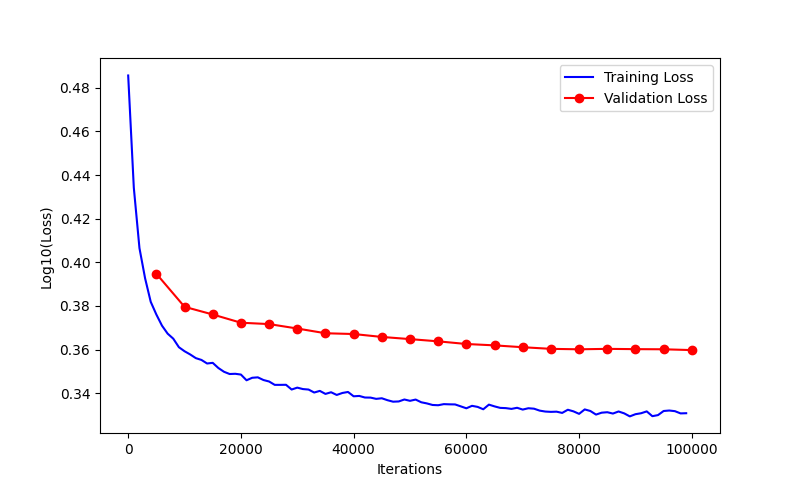

# WaveNet Language Model

This repository contains a PyTorch implementation of a WaveNet-style language model for character-level text generation. The model is designed to learn patterns in sequences of characters and generate new text based on the learned patterns.

## Model Architecture

The WaveNet language model follows the architecture described in the original WaveNet paper, using dilated convolutions and residual connections for efficient sequence modeling. This implementation specifically focuses on character-level language modeling using a dataset of names.

### Key Components:

1. **Embedding Layer**: Converts character indices to dense vector representations
2. **Dilated Convolutional Layers**: Compresses the sequence dimension while maintaining receptive field
3. **Batch Normalization**: Stabilizes training by normalizing layer inputs
4. **GELU Activation**: Non-linear activation function for better gradient flow
5. **Dropout**: Regularization to prevent overfitting

## Files Structure

```
wave-net language model/
├── main/
│   ├── wave_net_model.py     # Main WaveNet model implementation
│   ├── tokenizer.py          # Character-level tokenization utilities  
│   ├── create_dataset.py     # Dataset creation and preprocessing
│   ├── embedding.py          # Embedding layer implementation
│   ├── flatten_consecutive.py# Sequence flattening for compression
│   ├── batch_norm_1d.py      # Custom 1D Batch Normalization
│   ├── plotting.py           # Training loss visualization
│   └── main.py               # Main execution script
├── resources/
│   └── names.txt             # Dataset of names used for training
├── Figure_1.png              # Loss graph showing training progress
├── performance_log.txt       # Performance logs from training runs
└── README.md                 # This file
```

## Model Parameters

| Parameter | Value | Description |
|----------|-------|-------------|
| Context Length | 16 | Number of characters used as context for prediction |
| Feature Dimension | 24 | Embedding vector size |
| Hidden Neurons | 128 | Number of neurons in hidden layers |
| Batch Size | 128 | Training batch size |
| Learning Rate | 0.001 | Initial learning rate |
| L2 Regularization | 1e-5 | Weight decay coefficient |
| Dropout Rate | 0.3 | Probability for dropout layers |

## Training Process

The model uses a sophisticated training setup with:

- **Optimization**: Stochastic Gradient Descent (SGD) optimizer
- **Learning Rate Scheduling**: OneCycleLR for dynamic learning rate adjustment
- **Early Stopping**: Stops training when validation loss reaches acceptable threshold
- **Regularization**: L2 regularization and dropout

## Performance



The model achieved results on the names dataset with a final validation loss of approximately 2.17.

## Usage

To run the model:

```bash
cd wave-net language model/main
python main.py
```

This will:
1. Load the names dataset
2. Train the model for 100,000 iterations
3. Display training progress and final results
4. Plot the loss curve

## Requirements

- Python 3.7+
- PyTorch
- Matplotlib
- NumPy

## References

This implementation is inspired by the WaveNet paper:
> "WaveNet: A Generative Model for Raw Audio" by Aaron van den Oord et al.